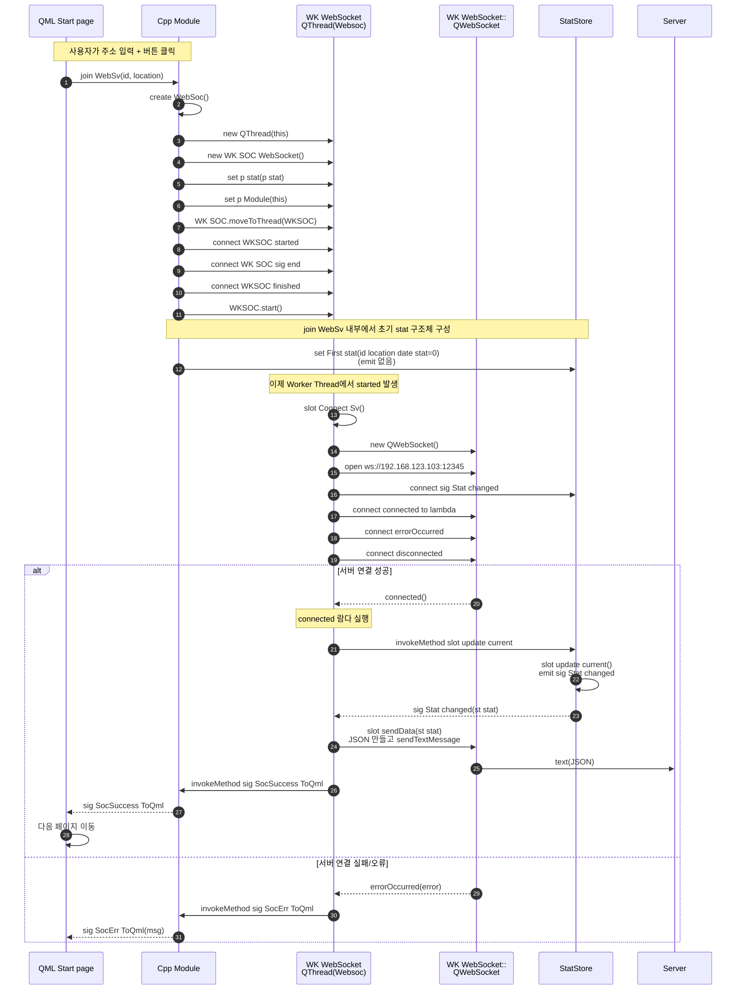

# WebSocket 연결 플로우

## 2. 시퀀스 다이어그램

```mermaid
sequenceDiagram
    autonumber

    participant QML as QML Start page
    participant MOD as Cpp Module

    participant WKSOC as WK WebSocket<br/>QThread(Websoc)

    participant WKSOCWS as WK WebSocket::<br/>QWebSocket

    participant STAT as StatStore

    participant SV as Server

    Note over QML,MOD: 사용자가 주소 입력 + 버튼 클릭

    QML->>MOD: join WebSv(id, location)
    MOD->>MOD: create WebSoc()
    MOD->>WKSOC: new QThread(this)
    MOD->>WKSOC: new WK SOC WebSocket()
    MOD->>WKSOC: set p stat(p stat)
    MOD->>WKSOC: set p Module(this)
    MOD->>WKSOC: WK SOC.moveToThread(WKSOC)

    MOD->>WKSOC: connect WKSOC started
    MOD->>WKSOC: connect WK SOC sig end
    MOD->>WKSOC: connect WKSOC finished
    MOD->>WKSOC: WKSOC.start()

    Note over MOD,STAT: join WebSv 내부에서 초기 stat 구조체 구성
    MOD->>STAT: set First stat(id location date stat=0)<br/>(emit 없음)

    Note over WKSOC,WKSOC: 이제 Worker Thread에서 started 발생
    WKSOC->>WKSOC: slot Connect Sv()

    WKSOC->>WKSOCWS: new QWebSocket()
    WKSOC->>WKSOCWS: open ws://192.168.123.103:12345
    WKSOC->>STAT: connect sig Stat changed
    WKSOC->>WKSOCWS: connect connected to lambda
    WKSOC->>WKSOCWS: connect errorOccurred
    WKSOC->>WKSOCWS: connect disconnected

    alt 서버 연결 성공
        WKSOCWS-->>WKSOC: connected()
        Note over WKSOC: connected 람다 실행

        WKSOC->>STAT: invokeMethod slot update current
        STAT->>STAT: slot update current()<br/>emit sig Stat changed
        STAT-->>WKSOC: sig Stat changed(st stat)
        WKSOC->>WKSOCWS: slot sendData(st stat)<br/>JSON 만들고 sendTextMessage
        WKSOCWS->>SV: text(JSON)

        WKSOC->>MOD: invokeMethod sig SocSuccess ToQml
        MOD-->>QML: sig SocSuccess ToQml
        QML->>QML: 다음 페이지 이동
    else 서버 연결 실패/오류
        WKSOCWS-->>WKSOC: errorOccurred(error)
        WKSOC->>MOD: invokeMethod sig SocErr ToQml
        MOD-->>QML: sig SocErr ToQml(msg)
    end
```
