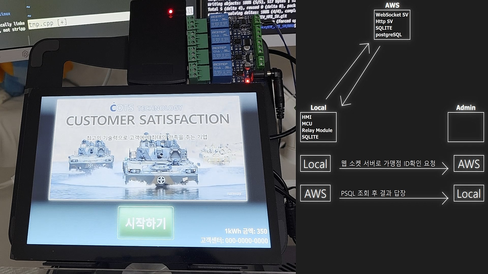
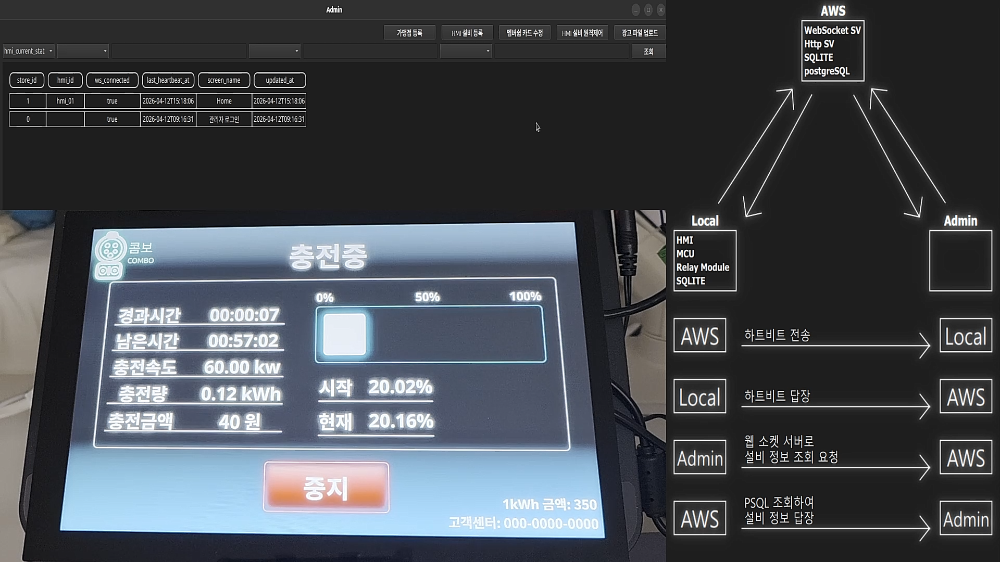
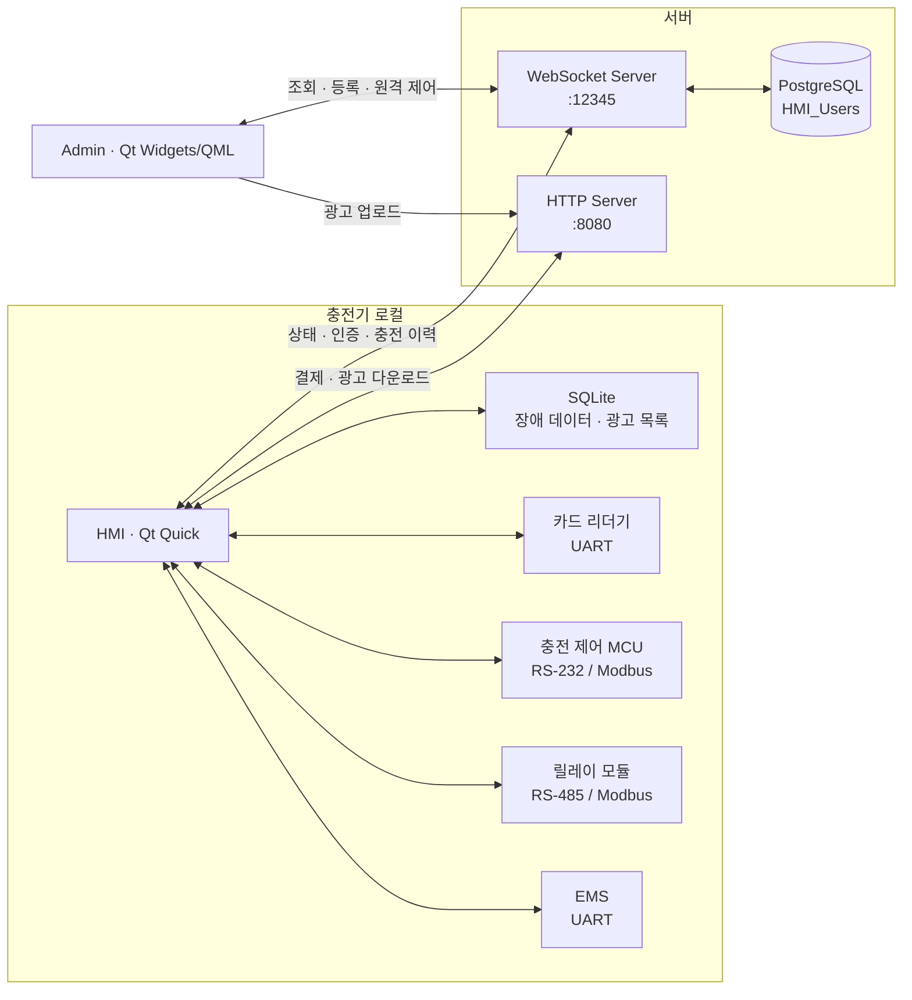

[README.md](https://github.com/user-attachments/files/30702017/README.md)
# EV Charging HMI & Server


전기차 충전기의 사용자 화면부터 현장 장치 제어, 결제·회원 인증, 충전 이력 저장, 원격 관리까지 하나의 흐름으로 구현한 Qt 기반 EV 충전 HMI 시스템입니다.

현장 HMI는 카드 리더기, 충전 제어 MCU, 릴레이 모듈, EMS와 시리얼 통신하며 WebSocket 서버를 통해 PostgreSQL 및 관리자 프로그램과 연결됩니다. 네트워크 장애 중 발생한 결제·충전 데이터는 SQLite에 보관한 뒤 연결 복구 시 다시 전송합니다.

> 이 저장소는 실제 하드웨어 연동을 포함한 프로토타입입니다. 실행 전 서버 주소, DB 접속 정보, 로컬 경로를 환경에 맞게 수정해야 합니다.

## 동작 화면

<table>
  <tr>
    <td align="center"><b>충전 HMI</b></td>
    <td align="center"><b>HMI 모니터링 및 관리자 화면</b></td>
  </tr>
  <tr>
    <td></td>
    <td></td>
  </tr>
</table>

시연 영상은 [`Diagram/screen/HMI_ok/코츠용/HMI_ok.gif`](./Diagram/screen/HMI_ok/코츠용/HMI_ok.gif)와 [`Diagram/screen/Admin_ok/코츠용/KMPlayer_ok.gif`](./Diagram/screen/Admin_ok/코츠용/KMPlayer_ok.gif)에서 확인할 수 있습니다.

## 주요 기능

### 충전 HMI

- 시간, 금액, 충전량(kWh), 목표 충전율(80%) 기준 충전 방식 선택
- 신용카드와 회원카드 인증 및 선결제·부분 취소 처리
- 충전 경과 시간, 남은 시간, 출력, 충전량, 금액, 배터리 SOC 실시간 표시
- 충전 커넥터 잠금/해제, 충전 시작/정지 및 EMS 상태 연동
- 광고 영상 다운로드·재생 목록 관리
- 서버 연결 상태 감지, 재연결, 유지보수 화면 전환
- 네트워크 장애 시 결제·회원·충전 데이터를 로컬 SQLite에 저장하고 재전송

### WebSocket 서버

- HMI와 Admin 클라이언트를 역할별로 식별하고 연결 관리
- 10초 간격 heartbeat로 HMI 접속 여부와 현재 화면 추적
- 충전 이력, 회원카드 거래, HMI 상태를 PostgreSQL에 저장
- 관리자 조회 요청과 HMI 원격 제어 명령 중계
- DB 장애 시 SQLite 백업 데이터를 60초 간격으로 재처리

### 관리자 프로그램

- 가맹점 및 HMI 장치 등록
- 충전 이력, HMI 현재 상태, 등록 장치, 회원카드, 회원 거래 이력, 가맹점 조회
- 회원카드 잔액·hold 금액·거래 상태 수정
- 충전 단가와 결제 대상 설정
- HMI 화면 전환, 커넥터 보관함/커넥터 잠금 해제, 종료·재시작
- 광고 MP4 업로드 및 HMI 광고 추가·삭제

### HTTP 서버

- 신용카드 결제·취소 응답을 제공하는 테스트용 API
- `application/mp4/upload`, `application/mp4/download` 방식의 광고 파일 전송
- 기본 포트 `8080`, 엔드포인트 `/compare`

## 시스템 구성



대표 WebSocket 메시지는 다음과 같습니다.

| 구분 | 메시지 `type` | 용도 |
| --- | --- | --- |
| 연결 | `hello`, `hello_ack` | Admin/HMI 역할 및 장치 식별 |
| 상태 | `heartbit_ping`, `heartbit_pong` | 접속 상태와 현재 화면 갱신 |
| 충전 | `chargingLog`, `chargingLog_ack` | 인증·충전 시작·종료 이력 저장 |
| 회원 | `membershipCard_authorized`, `membershipCard_finished` | 회원 잔액 hold 및 정산 |
| 관리 | `select`, `register`, `register_hmi` | 데이터 조회와 장치 등록 |
| 원격 제어 | `revision_HMI` | 화면, 단가, 결제 방식, 잠금, 광고, 전원 제어 |

## 저장소 구조

```text
EV_HMI_SV/
├─ HMI/              # 충전기용 Qt Quick HMI
├─ WebSocSv/         # WebSocket 허브 및 PostgreSQL/SQLite 처리
├─ HttpSv/           # 결제 테스트 및 광고 파일 HTTP 서버
├─ Admin/            # Qt Widgets + QML 관리자 프로그램
├─ Diagram/          # 시스템 구성도 뷰어와 시연 자료
├─ Common/           # 모듈 공용 데이터 구조
├─ Launcher/         # Linux HMI 감시·재시작 런처
├─ service/          # systemd user service 및 데스크톱 실행 아이콘
├─ psql_backUp/      # PostgreSQL 스키마·샘플 데이터 덤프
└─ Modbus RTU/       # Windows용 Modbus RTU 테스트 도구
```

각 애플리케이션은 독립된 CMake 프로젝트입니다. 저장소 루트에는 통합 `CMakeLists.txt`가 없습니다.

## 기술 스택

- C++17, C99, CMake
- Qt 6: Core, Quick, Quick Controls 2, Quick Effects, Widgets, QML, Quick Widgets
- Qt WebSockets, Network, HTTP Server, Serial Port, SQL, Multimedia(QML 런타임)
- PostgreSQL (`QPSQL`) 및 SQLite (`QSQLITE`)
- RS-232, RS-485 Modbus RTU, UART
- Linux systemd user service, Wayland

## 시작하기

### 1. 요구 사항

- CMake 3.19 이상
- Qt 6.8 이상 권장
  - `WebSocSv`, `HMI`, `Diagram`의 CMake 설정이 Qt 6.8을 요구합니다.
  - 필요한 Qt 모듈은 위 기술 스택 항목을 참고하세요.
- C++17 호환 컴파일러
- PostgreSQL 18 권장 및 Qt PostgreSQL 드라이버
- Linux 빌드 시 `libpq` 개발 패키지
- 실제 HMI 구동 시 아래 시리얼 장치와 접근 권한

이 문서는 Qt 6.9.3, CMake 3.30.5, MinGW 13.1 환경에서 CMake 구성과 아래 표의 모듈별 빌드 결과를 확인했습니다.

### 2. 저장소 받기

```bash
git clone https://github.com/siroimono-0/EV_HMI_SV.git
cd EV_HMI_SV
```

### 3. PostgreSQL 초기화

`psql_backUp/all_ubuntu_fixed.sql`은 PostgreSQL 18.2에서 생성한 클러스터 덤프이며 `HMI_Users` 데이터베이스, 테이블, 시퀀스, 함수와 샘플 데이터를 포함합니다. 빈 개발용 PostgreSQL 인스턴스에서 실행하는 것을 권장합니다.

```bash
psql -U postgres -d postgres -f psql_backUp/all_ubuntu_fixed.sql
```

서버의 DB 연결 정보는 `WebSocSv/Cpp_Module/DB_PostgreSQL.cpp`의 `createDB()`에서 설정합니다. 현재 코드는 `localhost:5432`, DB 이름 `HMI_Users`, 사용자 `postgres`를 기준으로 합니다. 저장소에 접속 비밀번호를 추가로 커밋하지 말고 환경 변수나 별도 설정 파일로 분리하세요.

### 4. 서버 및 로컬 경로 설정

빌드 전에 다음 하드코딩 값을 실행 환경에 맞게 변경해야 합니다.

| 설정 | 파일 | 확인할 내용 |
| --- | --- | --- |
| HMI WebSocket/HTTP 주소 | `HMI/Cpp_Module/WK_WebSocket.cpp` | Windows와 Linux용 서버 호스트 |
| Admin WebSocket/HTTP 주소 | `Admin/CppModule/WK_soc.cpp` | 관리자 연결 및 광고 업로드 호스트 |
| PostgreSQL 접속 정보 | `WebSocSv/Cpp_Module/DB_PostgreSQL.cpp` | host, port, DB, user, password |
| Admin QML 경로 | `Admin/Admin.cpp` | 운영체제별 절대 경로 6곳 |
| Windows `libpq.dll` | `HMI/CMakeLists.txt`, `WebSocSv/CMakeLists.txt` | 설치된 PostgreSQL 버전의 경로 |
| Linux HMI 실행 경로 | `Launcher/Launcher.cpp` | 빌드된 `appHMI` 위치 |
| systemd 실행 경로 | `service/test.service*` | `WorkingDirectory`, `ExecStart` |

### 5. 빌드

모듈마다 아래 명령을 실행합니다. `<MODULE>`에는 `HMI`, `WebSocSv`, `HttpSv`, `Admin`, `Diagram` 중 하나를 넣습니다.

```bash
cmake -S <MODULE> -B build/<MODULE> \
  -DCMAKE_PREFIX_PATH="<QT_KIT_PATH>" \
  -DCMAKE_BUILD_TYPE=Release

cmake --build build/<MODULE> --config Release --parallel
```

예시:

```bash
cmake -S HMI -B build/HMI \
  -DCMAKE_PREFIX_PATH="/opt/Qt/6.8.3/gcc_64" \
  -DCMAKE_BUILD_TYPE=Release
cmake --build build/HMI --parallel
```

생성되는 실행 파일은 다음과 같습니다.

| 모듈 | CMake target | 역할 |
| --- | --- | --- |
| `WebSocSv` | `appWebSocSv` | WebSocket 및 DB 서버 |
| `HttpSv` | `HttpSv` | 결제 테스트 및 파일 서버 |
| `Admin` | `appAdmin` | 관리자 GUI |
| `HMI` | `appHMI` | 충전기 HMI |
| `Diagram` | `appDiagram` | 시스템 구성도 뷰어 |

### 6. 실행 순서

1. PostgreSQL을 시작합니다.
2. `appWebSocSv`를 실행합니다.
3. 결제 테스트나 광고 전송이 필요하면 `HttpSv`를 실행합니다.
4. `appAdmin`에서 가맹점과 HMI 장치를 등록합니다.
5. `appHMI`를 실행하고 등록한 가맹점 ID로 서버에 연결합니다.

기본 포트는 WebSocket `12345`, HTTP `8080`, PostgreSQL `5432`입니다.

## 하드웨어 연결

HMI는 포트 이름을 고정하지 않고 USB 장치의 description, manufacturer, VID, PID를 모두 비교해 역할을 결정합니다. 모든 포트는 `9600 baud`, `8 data bits`, `no parity`, `1 stop bit`, `no flow control`로 열립니다.

| 역할 | 연결 | USB VID:PID | 코드상 장치 예시 |
| --- | --- | --- | --- |
| 충전 제어 MCU | RS-232 / Modbus | `067b:2303` | Prolific USB-to-Serial |
| 릴레이 모듈 | RS-485 / Modbus | `1a86:7523` | CH340 |
| EMS | UART | `0403:6001` | FTDI FT232R |
| 카드 리더기 | UART | `10c4:ea60` | Silicon Labs CP210x |

Linux에서는 현재 `ttyUSB`가 포함된 포트만 검색합니다. 장치명이 다르거나 USB 식별 문자열이 코드와 다르면 `HMI/Cpp_Module/WK_Serial.cpp`의 `serial_init()` 및 `serial_compare()`를 수정해야 합니다.

## 로컬 데이터

HMI와 서버는 `QStandardPaths::AppDataLocation` 아래에 런타임 데이터를 생성합니다.

- `db_lite.sqlite3`: 광고 목록과 네트워크 장애 중 발생한 결제·회원·충전 데이터
- HMI AppDataLocation 루트: HMI가 내려받은 광고 영상
- `mp4/`: HTTP 서버가 업로드로 수신한 광고 영상

저장소의 `HMI/SQLITE`, `WebSocSv/SQLITE`, `Admin/mp4`, `HttpSv/mp4`는 개발·시연용 데이터입니다. 실제 실행 위치는 운영체제의 AppDataLocation에 따라 달라집니다.
